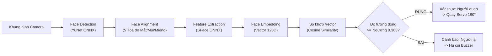

# TÀI LIỆU LÝ THUYẾT NỀN TẢNG (THEORETICAL FOUNDATION)
## HỆ THỐNG NHẬN DIỆN KHUÔN MẶT - SERVO & BUZZER TRÊN RASPBERRY PI 4

---

## 1. THỊ GIÁC MÁY TÍNH VÀ NHẬN DIỆN KHUÔN MẶT (FACE RECOGNITION)

Hệ thống nhận diện khuôn mặt hiện đại bao gồm một chuỗi các bước xử lý liên tiếp (Pipeline) từ ảnh thô đến định danh người dùng:



### 1.1. Phân biệt Phát hiện (Detection) và Nhận diện (Recognition)
- **Face Detection (Phát hiện khuôn mặt)**: Trả lời câu hỏi *"Có khuôn mặt nào trong ảnh không và nằm ở tọa độ nào?"*. Đầu ra là hộp bao (Bounding Box: $x, y, w, h$) và các điểm mốc khuôn mặt (Landmarks).
- **Face Recognition (Nhận diện khuôn mặt)**: Trả lời câu hỏi *"Khuôn mặt đó là của ai trong cơ sở dữ liệu?"*. Đầu ra là danh tính (Identity / Name) hoặc phân loại là "Người lạ" (Unknown).

### 1.2. Mô hình Phát hiện Khuôn mặt: YuNet
- **YuNet** là mô hình mạng nơ-ron tích chập (CNN) phát hiện khuôn mặt siêu nhẹ (~200KB), được tích hợp chính thức vào OpenCV 4.5.4+ (`cv2.FaceDetectorYN`).
- **Ưu điểm vượt trội trên Raspberry Pi**:
  - Tốc độ xử lý cực nhanh (15 - 30 FPS trên CPU ARM Cortex-A72 của Pi 4 mà không cần GPU rời).
  - Độ chính xác cao, phát hiện tốt khuôn mặt nghiêng, đeo khẩu trang hoặc điều kiện thiếu sáng (vượt trội hơn rất nhiều so với phương pháp cổ điển Haar Cascade).
  - Trích xuất đồng thời 5 điểm mốc (Landmarks: 2 mắt, đỉnh mũi, 2 khóe miệng) phục vụ chuẩn hóa xoay khuôn mặt (Face Alignment).

### 1.3. Mô hình Trích xuất Đặc trưng: SFace
- **SFace** là mô hình mạng nơ-ron học sâu dựa trên kiến trúc SphereFace / CosFace, kích thước nhỏ (~4MB) chạy trực tiếp qua `cv2.FaceRecognizerSF`.
- **Cơ chế biểu diễn Vector (Face Embedding)**:
  - SFace nhận ảnh khuôn mặt đã được cắt và xoay thẳng (Cropped & Aligned 112x112 pixel).
  - Biến đổi ảnh này thành một vector số thực 128 chiều:
    $$\vec{v} = [x_1, x_2, \dots, x_{128}] \in \mathbb{R}^{128}$$
  - Điểm đặc biệt: Hai ảnh của cùng một người (dù khác góc chụp, ánh sáng) sẽ có các vector nằm rất gần nhau trong không gian 128 chiều; trong khi ảnh của hai người khác nhau sẽ có vector nằm cách xa nhau.

### 1.4. So khớp Đặc trưng bằng Cosine Similarity
Để so sánh độ giống nhau giữa vector khuôn mặt đang phát hiện $\vec{u}$ và vector đã lưu trong database $\vec{v}$, hệ thống sử dụng **Cosine Similarity**:

$$\text{Cosine Similarity}(\vec{u}, \vec{v}) = \frac{\vec{u} \cdot \vec{v}}{\|\vec{u}\| \|\vec{v}\|} = \frac{\sum_{i=1}^{128} u_i v_i}{\sqrt{\sum_{i=1}^{128} u_i^2} \sqrt{\sum_{i=1}^{128} v_i^2}}$$

- Giá trị nằm trong khoảng $[-1, 1]$:
  - Càng gần $1.0$: Khuôn mặt càng giống nhau tuyệt đối.
  - Ngưỡng chuẩn nghiệm chứng của mô hình SFace: **$\text{Threshold} = 0.363$**.
  - Nếu $\max(\text{Cosine Similarity}) \ge 0.363 \rightarrow$ Xác nhận là **Người đã đăng ký**.
  - Nếu $\max(\text{Cosine Similarity}) < 0.363 \rightarrow$ Xác nhận là **Người lạ (Unknown)**.

---

## 2. NGUYÊN LÝ TRUYỀN PHÁT LUỒNG VIDEO (HTTP MJPEG STREAMING)

### 2.1. Cấu trúc Multipart MIME
Stream MJPEG (Motion JPEG) truyền tải liên tục chuỗi các khung hình JPEG độc lập thông qua một kết nối HTTP mở dài hạn (Persistent Connection).

Mỗi khung hình được phân tách bằng một đường biên (Boundary delimiter):
```http
HTTP/1.1 200 OK
Content-Type: multipart/x-mixed-replace; boundary=frame

--frame
Content-Type: image/jpeg
Content-Length: 35420

<Dữ liệu nhị phân ảnh JPEG 1>
--frame
Content-Type: image/jpeg
Content-Length: 35210

<Dữ liệu nhị phân ảnh JPEG 2>
...
```

### 2.2. Vấn đề Trễ Khung hình (Latency) & Giải pháp Đa Luồng (Threading)
- Trong OpenCV thông thường, `cv2.VideoCapture("http://...")` duy trì một hàng đợi đệm (Internal Buffer). Nếu vòng lặp xử lý AI bị chậm (ví dụ 100ms/frame), buffer sẽ bị đầy và video hiển thị sẽ bị trễ dần (Lag trôi thời gian từ vài giây đến hàng chục giây).
- **Giải pháp**: Xây dựng một luồng nền riêng (Reader Thread) chỉ liên tục đọc khung hình mới nhất từ socket và lưu vào biến chia sẻ có Lock hoặc Queue size=1 (bỏ qua frame cũ). Khung hình gửi vào bộ xử lý AI luôn luôn là khung hình thời gian thực (Zero Latency).

---

## 3. NGUYÊN LÝ ĐIỀU KHIỂN ĐỘNG CƠ SERVO BẰNG PWM

### 3.1. Tín hiệu Điều chế Độ rộng Xung (Pulse Width Modulation - PWM)
Động cơ RC Servo (như SG90, MG996R) không quay liên tục 360 độ như motor thông thường mà hoạt động dựa trên cơ chế phản hồi góc kín (Closed-loop position control).

- **Tần số chuẩn**: $f = 50\text{ Hz} \iff \text{Chu kỳ } T = \frac{1}{50} = 20\text{ ms}$.
- **Góc quay của trục**: Được quyết định trực tiếp bởi **thời gian xung ở mức HIGH ($T_{on}$)** trong mỗi chu kỳ 20ms:
  - $T_{on} \approx 0.5\text{ ms} - 1.0\text{ ms} \longrightarrow$ Góc quay **0°** (Chu kỳ nhiệm vụ $\text{Duty Cycle} \approx 2.5\% - 5.0\%$).
  - $T_{on} \approx 1.5\text{ ms} \longrightarrow$ Góc quay **90°** (Chu kỳ nhiệm vụ $\text{Duty Cycle} \approx 7.5\%$).
  - $T_{on} \approx 2.0\text{ ms} - 2.5\text{ ms} \longrightarrow$ Góc quay **180°** (Chu kỳ nhiệm vụ $\text{Duty Cycle} \approx 10.0\% - 12.5\%$).

```text
    |<--------------------- Chu kỳ T = 20ms (50Hz) --------------------->|
    
    +--+                                                                 +--+
    |  |                                                                 |  |
    +  +-----------------------------------------------------------------+  +--- 0.5ms (Góc 0 độ)
    
    +------+                                                             +------+
    |      |                                                             |      |
    +      +-------------------------------------------------------------+      +--- 1.5ms (Góc 90 độ)
    
    +----------+                                                         +----------+
    |          |                                                         |          |
    +          +---------------------------------------------------------+          +--- 2.5ms (Góc 180 độ)
```

### 3.2. Hiện tượng Rung Lắc (Jitter) trên Raspberry Pi & Khắc phục
- Hệ điều hành Linux trên Raspberry Pi là hệ điều hành đa nhiệm không thời gian thực (Non-Real-Time OS). Khi dùng PWM phần mềm (`RPi.GPIO.PWM`), việc chia sẻ CPU với các tác vụ AI có thể làm sai lệch độ rộng xung vài micro giây, dẫn đến việc servo bị rung lắc hoặc rên è è.
- **Giải pháp**:
  - Sử dụng chân **Hardware PWM (GPIO 18 - PWM0)** của chip BCM2711 trên Pi 4 để xung phát từ phần cứng đồng hồ của chip, hoặc thư viện `gpiozero` / `pigpio`.
  - Sau khi điều khiển servo tới góc mong muốn (0° hoặc 180°), cho nghỉ một khoảng trễ ngắn (0.5s để động cơ quay tới đích) rồi tắt phát xung (`duty_cycle = 0` hoặc `stop()`), giúp servo đứng im hoàn toàn, không tiêu tốn điện và không nóng mô-tơ.

---

## 4. NGUYÊN LÝ HOẠT ĐỘNG CỦA CÒI BÁO ĐỘNG (BUZZER)

### 4.1. Phân biệt Active Buzzer và Passive Buzzer
1. **Active Buzzer (Còi chủ động)**:
   - Tích hợp sẵn một mạch dao động đa hài (Oscillator circuit) bên trong.
   - Chỉ cần cấp điện áp DC trực tiếp (mức logic HIGH 3.3V hoặc 5V) là còi tự tạo dao động làm màng loa rung ở tần số cố định (~2kHz) và phát ra tiếng bíp to.
   - Thích hợp nhất cho hệ thống báo động đơn giản, tiết kiệm tài nguyên xử lý của CPU.
2. **Passive Buzzer (Còi thụ động)**:
   - Không có mạch dao động sẵn bên trong, chỉ như một chiếc loa thạch anh mini.
   - Muốn kêu, vi điều khiển phải liên tục xuất tín hiệu sóng vuông PWM ở một tần số cụ thể (ví dụ phát xung 2000Hz thì còi kêu nốt 2kHz, đổi tần số đổi được nốt nhạc).

### 4.2. Bảo vệ Chân GPIO khi Kích Còi
- Mỗi chân GPIO của Raspberry Pi 4 chỉ chịu được dòng tải tối đa khoảng **16mA** (tổng toàn bộ chip không quá 50mA).
- Nếu sử dụng module Active Buzzer thông dụng đã có sẵn transistor dán trên board, chân tín hiệu chỉ tiêu thụ dòng kích < 1mA, rất an toàn cắm thẳng vào GPIO.
- Nếu dùng còi thạch anh hoặc còi điện từ công suất lớn hơn, bắt buộc phải dùng thêm transistor khuếch đại (NPN 2N2222) và diode dập xung ngược để bảo vệ vi điều khiển Pi.
