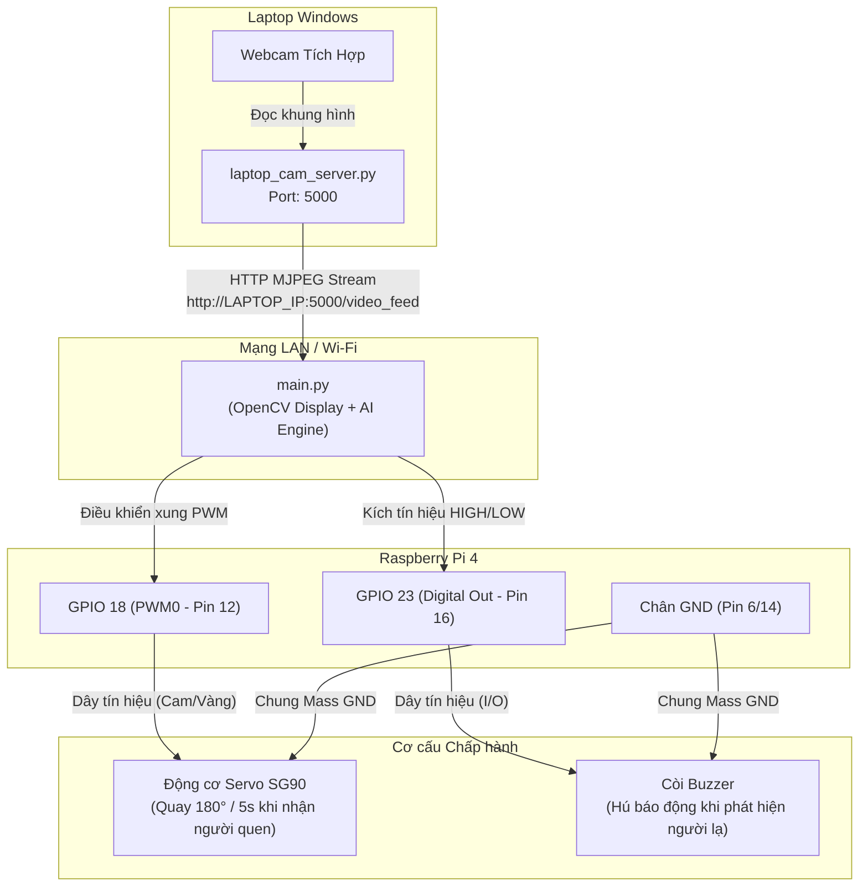

# HƯỚNG DẪN NỐI DÂY CHI TIẾT (WIRING GUIDE)
## HỆ THỐNG NHẬN DIỆN KHUÔN MẶT - SERVO & BUZZER TRÊN RASPBERRY PI 4

---

## 1. SƠ ĐỒ CHÂN RASPBERRY PI 4 (40-PIN GPIO HEADER)

Raspberry Pi 4 sử dụng chuẩn 40 chân GPIO vật lý (Physical Pin Numbering). Dưới đây là sơ đồ tham chiếu nhanh các chân sử dụng trong dự án:

```text
       3.3V Power  [ 1] [ 2]  5V Power (Khuyên dùng cấp nguồn phụ nếu cần)
     GPIO 2 (SDA)  [ 3] [ 4]  5V Power
     GPIO 3 (SCL)  [ 5] [ 6]  GND (Ground)
    GPIO 4 (GPCLK) [ 7] [ 8]  GPIO 14 (TXD)
           Ground  [ 9] [10]  GPIO 15 (RXD)
          GPIO 17  [11] [12]  GPIO 18 (PWM0 - ĐIỀU KHIỂN SERVO)  <-- Chân Servo PWM
          GPIO 27  [13] [14]  Ground  <-- Nối mass chung
          GPIO 22  [15] [16]  GPIO 23 (ĐIỀU KHIỂN CÒI BUZZER)    <-- Chân Buzzer
       3.3V Power  [17] [18]  GPIO 24
    GPIO 10 (MOSI) [19] [20]  Ground
    GPIO 9 (MISO)  [21] [22]  GPIO 25
    GPIO 11 (SCLK) [23] [24]  GPIO 8 (CE0)
           Ground  [25] [26]  GPIO 7 (CE1)
           ...     ...  ...
```

---

## 2. BẢNG ĐẤU NỐI LINH KIỆN CHI TIẾT

### 2.1. Động cơ Servo (SG90 / MG996R)
Động cơ Servo có 3 dây màu tiêu chuẩn:
- **Dây Nâu (Brown) hoặc Đen (Black)**: Cực âm GND.
- **Dây Đỏ (Red)**: Cực dương nguồn VCC (4.8V – 6.0V, danh định 5V).
- **Dây Cam (Orange) hoặc Vàng (Yellow)**: Dây tín hiệu xung điều khiển PWM.

| Dây của Servo | Chức năng | Vị trí kết nối trên Raspberry Pi 4 | Ghi chú an toàn |
| :--- | :--- | :--- | :--- |
| **Dây Cam (Signal)** | Tín hiệu PWM | **GPIO 18** (Chân vật lý 12) | Chân phần cứng Hardware PWM0, cho xung ổn định nhất |
| **Dây Đỏ (VCC)** | Nguồn dương | **Chân 5V** (Chân vật lý 2 hoặc 4) HOẶC **Nguồn 5V ngoài** | Khuyến nghị dùng nguồn 5V riêng nếu servo bị giật hoặc Pi báo thiếu áp |
| **Dây Nâu/Đen (GND)**| Nối đất | **GND** (Chân vật lý 6, 9 hoặc 14) | **Bắt buộc nối chung GND** giữa Pi và nguồn ngoài |

> [!WARNING]
> **LƯU Ý RẤT QUAN TRỌNG VỀ NGUỒN CẤP CHO SERVO:**
> Động cơ Servo khi khởi động hoặc quay tải nặng có dòng khởi động đột biến (Spike Current) lên tới 500mA - 1A. Nếu cắm trực tiếp dây Đỏ của Servo vào chân 5V của Raspberry Pi và củ sạc của Pi không đủ 3A chất lượng cao, Pi 4 có thể bị hiện tượng sụt nguồn dẫn tới **tự động khởi động lại (Reboot)** hoặc treo máy.  
> **Giải pháp tối ưu**: Cấp nguồn 5V rời (như Adapter 5V riêng hoặc module nguồn MB102) cho dây Đỏ và Đen của Servo, và nối một dây Mass (GND) từ nguồn ngoài sang chân GND của Pi để đồng pha tín hiệu.

---

### 2.2. Còi Báo Động (Buzzer)

#### Trường hợp A: Sử dụng Active Buzzer 5V / 3.3V (Khuyên Dùng)
Active Buzzer có sẵn mạch dao động bên trong, chỉ cần cấp điện áp mức HIGH (1) là còi tự động kêu, mức LOW (0) là còi tắt.

- Nếu dùng **Module Active Buzzer có 3 chân** (`VCC`, `GND`, `I/O` hoặc `SIG`):
  | Chân trên Module Buzzer | Chân trên Raspberry Pi 4 | Ghi chú |
  | :--- | :--- | :--- |
  | **VCC** | **Chân 3.3V** (Chân vật lý 1) hoặc **5V** (Chân 2) | Khuyên cắm 3.3V để tương thích logic GPIO |
  | **GND** | **Chân GND** (Chân vật lý 6 hoặc 14) | Nối đất |
  | **I/O (SIG)** | **GPIO 23** (Chân vật lý 16) | Chân điều khiển mức logic (HIGH = Kêu, LOW = Tắt) |

- Nếu dùng **Còi trần 2 chân (Piezo buzzer rời)**:
  - Chân dương (+) dài hơn: Nối vào **GPIO 23** (qua điện trở bảo vệ 100Ω – 220Ω hoặc qua Transistor NPN như 2N2222 nếu còi tiêu thụ dòng > 16mA).
  - Chân âm (-) ngắn hơn: Nối vào **GND** của Pi.

---

## 3. SƠ ĐỒ KẾT NỐI KHỐI (MERMAID DIAGRAM)



---

## 4. QUY TRÌNH KIỂM TRA PHẦN CỨNG TRƯỚC KHI CHẠY CHÍNH THỨC
1. **Kiểm tra ngắn mạch**: Dùng đồng hồ VOM hoặc mắt thường kiểm tra không để chân 5V chạm vào chân GPIO 3.3V hoặc chân GND.
2. **Kiểm tra Servo**: Chạy thử đoạn script Python điều khiển xung đơn giản trên Pi để kiểm tra servo quay từ 0° sang 180° mà không bị kẹt cơ khí.
3. **Kiểm tra Buzzer**: Kích mức `GPIO.output(23, GPIO.HIGH)` trong 0.5 giây để nghe tiếng còi bíp dứt khoát.
